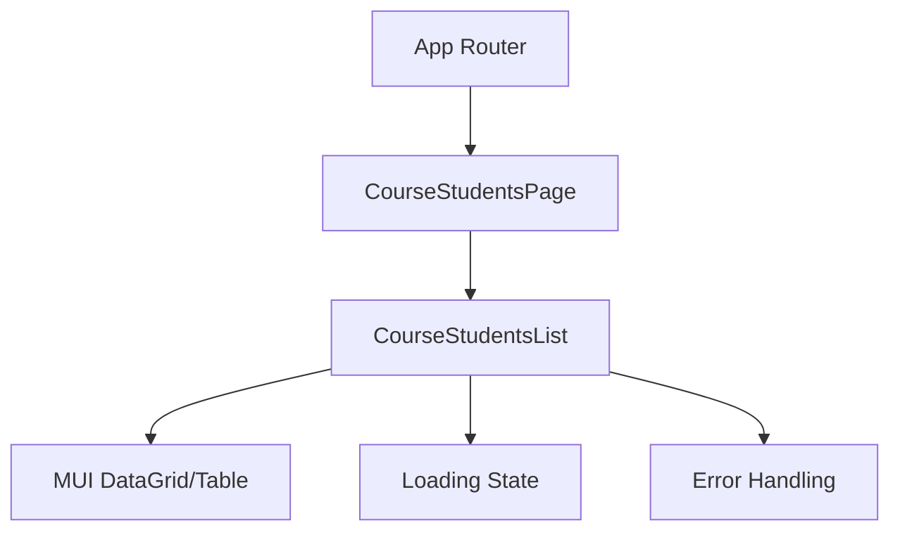
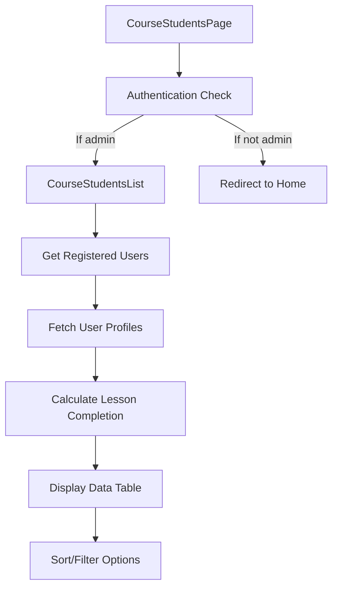

# Course Students Page Design

## Reference
- GitHub Issue: [#30](https://github.com/joeychia/online-course/issues/30)

## Overview

This document outlines the design for a new admin feature that displays all registered students for a specific course. The page will be accessible at `/admin/course/{course-id}/students` and will show each student's name, email, and completed lessons count.

## Business Requirements

1. Admin users need to view all students registered for a specific course
2. For each student, display:
   - Name
   - Email
   - Number of completed lessons
3. The page should be accessible from the course editor
4. Only admin users should have access to this page

## Technical Requirements

### Data Requirements

1. Retrieve all user IDs registered for a specific course
2. Fetch user profiles for each registered user
3. Calculate completed lessons count from user progress data
4. Format and display the data in a table

### Component Structure



### Data Flow



## UI/UX Design

### Layout

The page will follow the existing admin dashboard layout pattern:

1. Header with page title "Course Students"
2. Back button to return to course editor
3. Table displaying student information
4. Responsive design for mobile and desktop views

### Table Columns

1. Student Name
2. Email
3. Completed Lessons Count
4. Completion Percentage (optional enhancement)
5. Last Activity Date (optional enhancement)

### User Interactions

1. Click on column headers to sort data
2. Search/filter functionality (optional enhancement)
3. Back button to return to course editor
4. Pagination for courses with many students

## Implementation Details

### New Components

1. **CourseStudentsPage** (`src/pages/CourseStudentsPage.tsx`)
   - Main page component with authentication check
   - Uses course ID from URL params
   - Renders CourseStudentsList component

2. **CourseStudentsList** (`src/components/admin/CourseStudentsList.tsx`)
   - Handles data fetching and processing
   - Displays table of students
   - Implements sorting functionality

### Service Layer Updates

No service layer updates are required as the existing `firestoreService` already provides:
- `getRegisteredUsersForCourse(courseId)` - Gets user IDs registered for a course
- `getUserById(id)` - Gets user profile data

### Data Processing

For each user, we need to:
1. Count completed lessons for the specific course
2. Calculate completion percentage (optional)
3. Format data for display

```typescript
// Pseudocode for calculating completed lessons
function calculateCompletedLessons(userProfile: UserProfile, courseId: string): number {
  const courseProgress = userProfile.progress?.[courseId] || {};
  return Object.values(courseProgress).filter(progress => progress.completed).length;
}
```

### Routing Updates

Add a new route in the application's router:
```typescript
<Route path="/admin/course/:courseId/students" element={<CourseStudentsPage />} />
```

### Navigation Integration

Add a "View Students" button in the CourseEditor component to navigate to this page.

## Testing Strategy

### Unit Tests

1. Test CourseStudentsList component
   - Test rendering with mock data
   - Test sorting functionality
   - Test loading states
   - Test error handling

2. Test data processing functions
   - Test calculation of completed lessons
   - Test handling of edge cases (no progress data, etc.)

### Integration Tests

1. Test navigation from CourseEditor to CourseStudentsPage
2. Test authentication and authorization
3. Test data fetching and display

## Implementation Plan

1. Create the new page component
2. Create the student list component
3. Implement data fetching and processing logic
4. Design and implement the UI with Material UI
5. Add the new route to the router
6. Add navigation from the course editor to this page
7. Write tests
8. Add error handling and loading states

## Future Enhancements

1. Export student data to CSV
2. Filter students by completion status
3. Send email notifications to students from this page
4. View detailed progress for individual students
5. Group management integration
